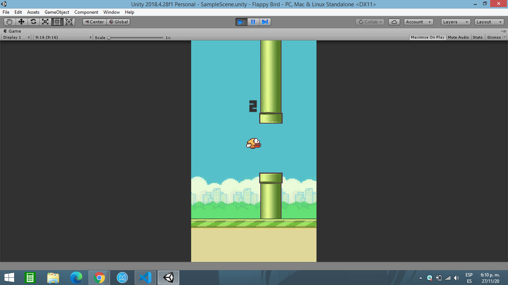

# Flappy Bird Unity Project

This is a [Unity](https://unity.com/) project bootstrapped with [`Unity Hub`].
### Flappy Bird Unity Project

* This app [`PC/Mobile`] is create with [Unity 2018.4.28f1](https://unity3d.com/es/unity/qa/lts-releases?version=2018.4).

First, run the development server:

```bash
git clone https://github.com/Victor1890/flappy_bird_unity.git
```

Enter the folder
```bash
cd flappy_bird_unity
```

Open the Sample Scene of game using **Unity**
```bash
cd Assets/Scenes/SampleScene.unity
```

### Screenshot

